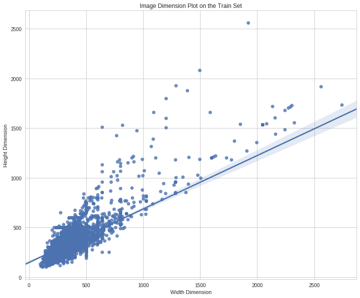
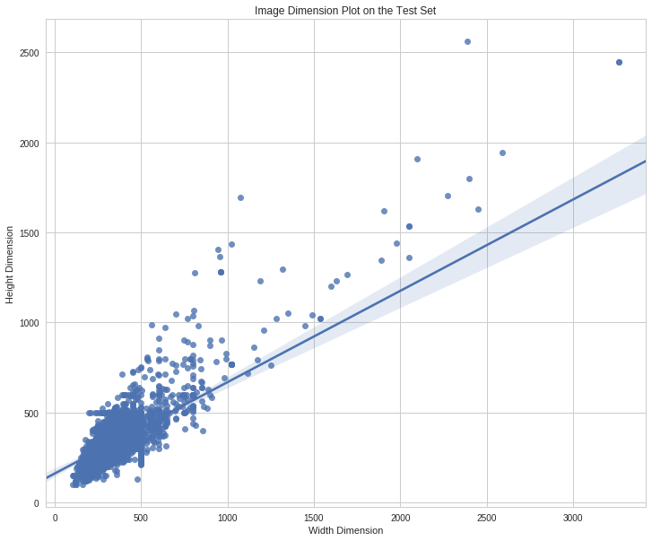
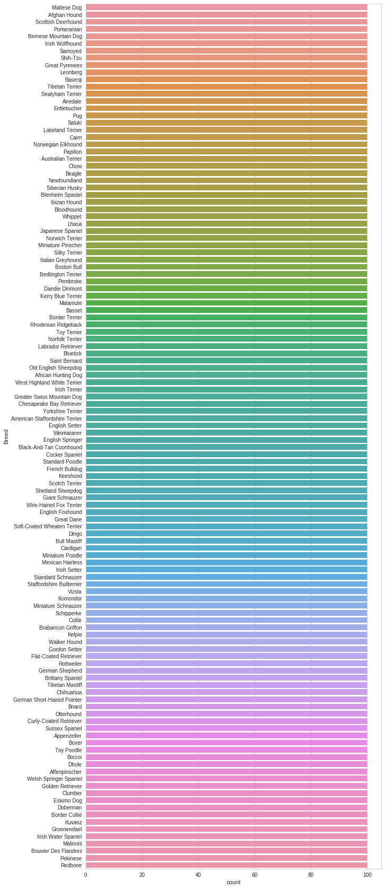
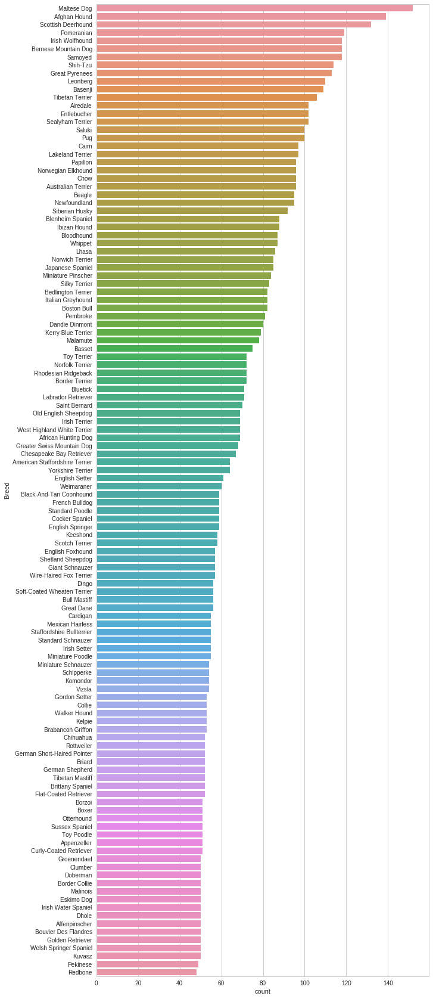
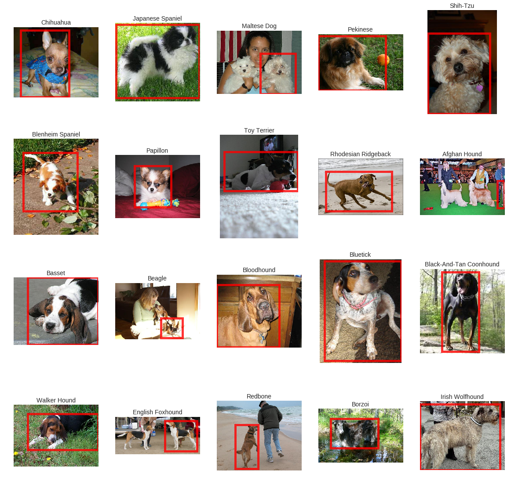
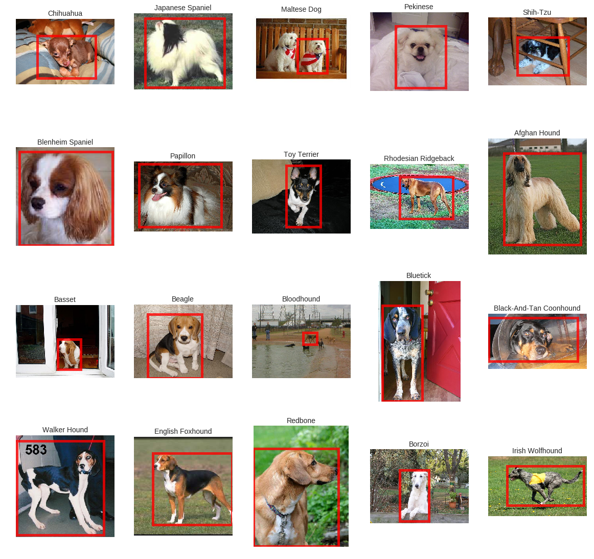
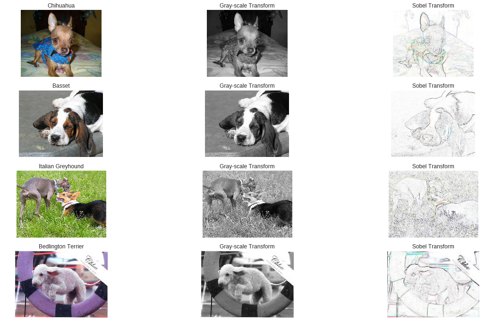
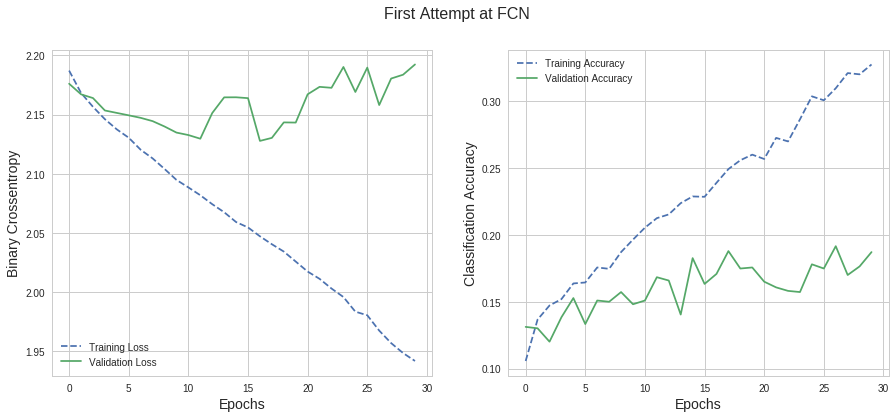

## Introduction and EDA
{:.no_toc}
*  
{: toc}


```python
!pip install -q xlrd
!git clone https://github.com/awrou/CS109A_FinalProject.git
!pip install imageio
```


```python
!pip install pydrive
```


```python
import pandas as pd
import numpy as np
import seaborn as sns

from matplotlib import pyplot as plt
from scipy.io import loadmat
from IPython.display import display
from tqdm import tqdm
from pydrive.auth import GoogleAuth
from pydrive.drive import GoogleDrive
from google.colab import auth
from oauth2client.client import GoogleCredentials
from google.colab import files
from keras.applications.vgg19 import VGG19
from keras import models
from keras import layers


import os
import imageio
import cv2
import keras


```


    Using TensorFlow backend.
    


```python
os.chdir('CS109A_FinalProject/')
```


# Load Training and Test Data


```python
# Load pre-constructed train/test arrays from Stanford Dataset
train_list = loadmat('./lists/train_list.mat')
test_list = loadmat('./lists/test_list.mat')
```


```python
# Split training data into a directory list, label list, and annotation list
file_list_train = [i.item() for i in train_list["file_list"].flatten()]
label_list_train = [i.item() for i in train_list["labels"].flatten()]
annotation_list_train = [i.item() for i in train_list['annotation_list'].flatten()]

# Split testing data into a directory list, label list, and annotation list
file_list_test = [i.item() for i in test_list["file_list"].flatten()]
label_list_test = [i.item() for i in test_list["labels"].flatten()]
annotation_list_test = [i.item() for i in test_list['annotation_list'].flatten()]
```


```python
# Examine contents of lists
print(file_list_train[0], "|", label_list_train[0], "|", annotation_list_train[0])
```


    n02085620-Chihuahua/n02085620_5927.jpg | 1 | n02085620-Chihuahua/n02085620_5927
    


```python
import re

# Build a function to extract the breed name from the file list
def extract_breed(file_string):
    return re.search(r'\-(.*?)\/',file_string).group(1)

# Function to extract the breed name and clean string
def clean_breed(file_string):    
    breed = re.search(r'\-(.*?)\/',file_string).group(1)
    breed = breed.replace("_", " ")
    breed = breed.title()
    
    return(breed)
```


```python
# Build DataFrames containing directory structure, name of breed, and label
breed_list_train = [clean_breed(i) for i in file_list_train]
breed_list_test = [clean_breed(i) for i in file_list_test]


train_df = pd.DataFrame(
    list(zip(file_list_train, annotation_list_train, breed_list_train, label_list_train)),
    columns=['File', 'Annotation', 'Breed', 'Label'])

test_df = pd.DataFrame(
    list(zip(file_list_test, annotation_list_test, breed_list_test, label_list_test)),
    columns=['File', 'Annotation', 'Breed', 'Label'])


#df_y_train = pd.get_dummies(pd.get_dummies(train.Label))
```


```python
train_df.head()
```


<div>
<style scoped>
    .dataframe tbody tr th:only-of-type {
        vertical-align: middle;
    }

    .dataframe tbody tr th {
        vertical-align: top;
    }

    .dataframe thead th {
        text-align: right;
    }
</style>
<table border="1" class="dataframe">
  <thead>
    <tr style="text-align: right;">
      <th></th>
      <th>File</th>
      <th>Annotation</th>
      <th>Breed</th>
      <th>Label</th>
    </tr>
  </thead>
  <tbody>
    <tr>
      <th>0</th>
      <td>n02085620-Chihuahua/n02085620_5927.jpg</td>
      <td>n02085620-Chihuahua/n02085620_5927</td>
      <td>Chihuahua</td>
      <td>1</td>
    </tr>
    <tr>
      <th>1</th>
      <td>n02085620-Chihuahua/n02085620_4441.jpg</td>
      <td>n02085620-Chihuahua/n02085620_4441</td>
      <td>Chihuahua</td>
      <td>1</td>
    </tr>
    <tr>
      <th>2</th>
      <td>n02085620-Chihuahua/n02085620_1502.jpg</td>
      <td>n02085620-Chihuahua/n02085620_1502</td>
      <td>Chihuahua</td>
      <td>1</td>
    </tr>
    <tr>
      <th>3</th>
      <td>n02085620-Chihuahua/n02085620_1916.jpg</td>
      <td>n02085620-Chihuahua/n02085620_1916</td>
      <td>Chihuahua</td>
      <td>1</td>
    </tr>
    <tr>
      <th>4</th>
      <td>n02085620-Chihuahua/n02085620_13151.jpg</td>
      <td>n02085620-Chihuahua/n02085620_13151</td>
      <td>Chihuahua</td>
      <td>1</td>
    </tr>
  </tbody>
</table>
</div>


```python
test_df.head()
```


<div>
<style scoped>
    .dataframe tbody tr th:only-of-type {
        vertical-align: middle;
    }

    .dataframe tbody tr th {
        vertical-align: top;
    }

    .dataframe thead th {
        text-align: right;
    }
</style>
<table border="1" class="dataframe">
  <thead>
    <tr style="text-align: right;">
      <th></th>
      <th>File</th>
      <th>Annotation</th>
      <th>Breed</th>
      <th>Label</th>
    </tr>
  </thead>
  <tbody>
    <tr>
      <th>0</th>
      <td>n02085620-Chihuahua/n02085620_2650.jpg</td>
      <td>n02085620-Chihuahua/n02085620_2650</td>
      <td>Chihuahua</td>
      <td>1</td>
    </tr>
    <tr>
      <th>1</th>
      <td>n02085620-Chihuahua/n02085620_4919.jpg</td>
      <td>n02085620-Chihuahua/n02085620_4919</td>
      <td>Chihuahua</td>
      <td>1</td>
    </tr>
    <tr>
      <th>2</th>
      <td>n02085620-Chihuahua/n02085620_1765.jpg</td>
      <td>n02085620-Chihuahua/n02085620_1765</td>
      <td>Chihuahua</td>
      <td>1</td>
    </tr>
    <tr>
      <th>3</th>
      <td>n02085620-Chihuahua/n02085620_3006.jpg</td>
      <td>n02085620-Chihuahua/n02085620_3006</td>
      <td>Chihuahua</td>
      <td>1</td>
    </tr>
    <tr>
      <th>4</th>
      <td>n02085620-Chihuahua/n02085620_1492.jpg</td>
      <td>n02085620-Chihuahua/n02085620_1492</td>
      <td>Chihuahua</td>
      <td>1</td>
    </tr>
  </tbody>
</table>
</div>


**Comments:**

*   The Stanford dataset comes with a matrix of file references to specific images.  It includes data on which breed each image is (a label that ranges from 1-120; so 120 breeds in total).  We load these file references, the breed, and the categorical label into a dataframe from ease of use.

*   We use a RegEx query to extract the name of the dog breed from each file reference

# Examine Image Dimensions


```python
%%time

# Create a blank list to store the dimensions of each image in training dataset
# Takes a considerable amount of time
# Don't re-run unless you have to

image_height = []
image_width = []

for index, value in train_df.iterrows():
    height, width, _ = imageio.imread("Images/" + train_df.iloc[index].File).shape
    image_height.append(height)
    image_width.append(width)
```


    CPU times: user 50.9 s, sys: 979 ms, total: 51.8 s
    Wall time: 51.9 s
    


```python
%%time

# Create a blank list to store the dimensions of each image in test dataset
# Takes a considerable amount of time

image_height_test = []
image_width_test = []

for index, value in test_df.iterrows():
    height, width, _  = imageio.imread("Images/" + test_df.iloc[index].File).shape
    image_height_test.append(height)
    image_width_test.append(width)
```


    CPU times: user 36.2 s, sys: 641 ms, total: 36.8 s
    Wall time: 36.8 s
    


```python
#Create a Dimensions, Height and Width column for future use 
test_df['Height'] = image_height_test
test_df['Width'] = image_width_test

train_df['Height'] = image_height
train_df['Width'] = image_width
```


```python
train_df.head()
```


<div>
<style scoped>
    .dataframe tbody tr th:only-of-type {
        vertical-align: middle;
    }

    .dataframe tbody tr th {
        vertical-align: top;
    }

    .dataframe thead th {
        text-align: right;
    }
</style>
<table border="1" class="dataframe">
  <thead>
    <tr style="text-align: right;">
      <th></th>
      <th>File</th>
      <th>Annotation</th>
      <th>Breed</th>
      <th>Label</th>
      <th>Height</th>
      <th>Width</th>
    </tr>
  </thead>
  <tbody>
    <tr>
      <th>0</th>
      <td>n02085620-Chihuahua/n02085620_5927.jpg</td>
      <td>n02085620-Chihuahua/n02085620_5927</td>
      <td>Chihuahua</td>
      <td>1</td>
      <td>300</td>
      <td>360</td>
    </tr>
    <tr>
      <th>1</th>
      <td>n02085620-Chihuahua/n02085620_4441.jpg</td>
      <td>n02085620-Chihuahua/n02085620_4441</td>
      <td>Chihuahua</td>
      <td>1</td>
      <td>500</td>
      <td>375</td>
    </tr>
    <tr>
      <th>2</th>
      <td>n02085620-Chihuahua/n02085620_1502.jpg</td>
      <td>n02085620-Chihuahua/n02085620_1502</td>
      <td>Chihuahua</td>
      <td>1</td>
      <td>333</td>
      <td>500</td>
    </tr>
    <tr>
      <th>3</th>
      <td>n02085620-Chihuahua/n02085620_1916.jpg</td>
      <td>n02085620-Chihuahua/n02085620_1916</td>
      <td>Chihuahua</td>
      <td>1</td>
      <td>495</td>
      <td>500</td>
    </tr>
    <tr>
      <th>4</th>
      <td>n02085620-Chihuahua/n02085620_13151.jpg</td>
      <td>n02085620-Chihuahua/n02085620_13151</td>
      <td>Chihuahua</td>
      <td>1</td>
      <td>336</td>
      <td>500</td>
    </tr>
  </tbody>
</table>
</div>


```python
test_df.head()
```


<div>
<style scoped>
    .dataframe tbody tr th:only-of-type {
        vertical-align: middle;
    }

    .dataframe tbody tr th {
        vertical-align: top;
    }

    .dataframe thead th {
        text-align: right;
    }
</style>
<table border="1" class="dataframe">
  <thead>
    <tr style="text-align: right;">
      <th></th>
      <th>File</th>
      <th>Annotation</th>
      <th>Breed</th>
      <th>Label</th>
      <th>Height</th>
      <th>Width</th>
    </tr>
  </thead>
  <tbody>
    <tr>
      <th>0</th>
      <td>n02085620-Chihuahua/n02085620_2650.jpg</td>
      <td>n02085620-Chihuahua/n02085620_2650</td>
      <td>Chihuahua</td>
      <td>1</td>
      <td>333</td>
      <td>500</td>
    </tr>
    <tr>
      <th>1</th>
      <td>n02085620-Chihuahua/n02085620_4919.jpg</td>
      <td>n02085620-Chihuahua/n02085620_4919</td>
      <td>Chihuahua</td>
      <td>1</td>
      <td>206</td>
      <td>240</td>
    </tr>
    <tr>
      <th>2</th>
      <td>n02085620-Chihuahua/n02085620_1765.jpg</td>
      <td>n02085620-Chihuahua/n02085620_1765</td>
      <td>Chihuahua</td>
      <td>1</td>
      <td>500</td>
      <td>391</td>
    </tr>
    <tr>
      <th>3</th>
      <td>n02085620-Chihuahua/n02085620_3006.jpg</td>
      <td>n02085620-Chihuahua/n02085620_3006</td>
      <td>Chihuahua</td>
      <td>1</td>
      <td>500</td>
      <td>369</td>
    </tr>
    <tr>
      <th>4</th>
      <td>n02085620-Chihuahua/n02085620_1492.jpg</td>
      <td>n02085620-Chihuahua/n02085620_1492</td>
      <td>Chihuahua</td>
      <td>1</td>
      <td>333</td>
      <td>500</td>
    </tr>
  </tbody>
</table>
</div>


```python
# Plot the Image Dimensions on the Train Set

sns.set(style="whitegrid")
fig, ax = plt.subplots(figsize=(12, 10))
ax = sns.regplot(x="Width", y="Height", data=train_df)
ax.set_title('Image Dimension Plot on the Train Set')
ax.set_ylabel('Height Dimension')
ax.set_xlabel('Width Dimension')
```


    Text(0.5,0,'Width Dimension')





```python
# Plot the Image Dimensions on the Test Set

sns.set(style="whitegrid")
fig, ax = plt.subplots(figsize=(12, 10))
ax = sns.regplot(x="Width", y="Height", data=test_df)
ax.set_title('Image Dimension Plot on the Test Set')
ax.set_ylabel('Height Dimension')
ax.set_xlabel('Width Dimension')
```


    Text(0.5,0,'Width Dimension')





**Comments: **

*   We see that the majority of images are clustered at around 250 pixels by 250 pixels, with a few images reaching as large as 2500 x 2000 pixels.  The large variation in image size is unfortunate, as we will have to re-size the images for use in a CNN (recall that such image resizing is not necessary for a fully-connected network, but it is for a CNN).  It'll be difficult to avoid warping images, forcing some to be squeezed, and others to be stretched.

*   Other ML researchers who, when faced with a similar issue of large variation in image size, have thrown out any images that are not within some pre-defined distance of the re-sizing dimensions (to avoid over-warping).  Unfortunately, we do not have this luxury are there are precious few observations. 


#Examine Distribution of Dog Breeds


```python
#Plot the breakdown of breeds in the training set
sns.set(style="whitegrid")
fig, ax = plt.subplots(figsize=(10, 30))
ax = sns.countplot(y="Breed", data=train_df,
                   order = test_df['Breed'].value_counts().index)
```


    /usr/local/lib/python3.6/dist-packages/seaborn/categorical.py:1428: FutureWarning: remove_na is deprecated and is a private function. Do not use.
      stat_data = remove_na(group_data)
    





```python
#Plot the breakdown of breeds in the test set
fig, ax = plt.subplots(figsize=(10, 30))
ax = sns.countplot(y="Breed", data=test_df, 
                   order = test_df['Breed'].value_counts().index)
```


    /usr/local/lib/python3.6/dist-packages/seaborn/categorical.py:1428: FutureWarning: remove_na is deprecated and is a private function. Do not use.
      stat_data = remove_na(group_data)
    





**Comments:**

* We see that the training set contains 120 breeds of dogs, evenly distributed, with 100 example images per breed, for a total of 12,000 images in total.  In Deep Learning contexts, this is an extremely small dataset, so we should expect low levels of accuracy on the overall model. 

* We see that the test set contains an uneven distribution of dog breeds.  


```python
#Generates a bounding box of the image of the dog from the Annotations list
def generate_bounding_box(file_string):
    file = open(file_string, 'r', encoding="utf-8")
    file_content=file.readlines() 

    x_min = float(re.search(r'<xmin>(.+?)</xmin>', file_content[18]).group(1))
    y_min = float(re.search(r'<ymin>(.+?)</ymin>', file_content[19]).group(1))
    x_max = float(re.search(r'<xmax>(.+?)</xmax>', file_content[20]).group(1))
    y_max = float(re.search(r'<ymax>(.+?)</ymax>', file_content[21]).group(1))  
    
    box_height = y_max - y_min  
    box_width = x_max - x_min
          
    #bounding_box = f"{x_min}, {y_min}, {box_width}, {box_height}"
    bounding_box = [x_min, y_min, box_width, box_height]

    return(bounding_box)     
```


```python
# Add bounding box data to the training set and test dataset
# Very slow to iterate over a dataframe and read in files 
%time

train_df['bounding_box'] = ""
test_df['bounding_box'] = ""

for index, breed in tqdm(train_df.iterrows()):
    train_df['bounding_box'][index] = generate_bounding_box("Annotation/" + train_df['Annotation'][index])
    
for index, breed in tqdm(test_df.iterrows()):
    test_df['bounding_box'][index] = generate_bounding_box("Annotation/" + test_df['Annotation'][index])
    
```


    0it [00:00, ?it/s]/usr/local/lib/python3.6/dist-packages/ipykernel_launcher.py:7: SettingWithCopyWarning: 
    A value is trying to be set on a copy of a slice from a DataFrame
    
    See the caveats in the documentation: http://pandas.pydata.org/pandas-docs/stable/indexing.html#indexing-view-versus-copy
      import sys
    1it [00:00,  8.00it/s]

    CPU times: user 7 µs, sys: 0 ns, total: 7 µs
    Wall time: 14.3 µs
    

    12000it [13:34, 14.74it/s]
    0it [00:00, ?it/s]/usr/local/lib/python3.6/dist-packages/ipykernel_launcher.py:10: SettingWithCopyWarning: 
    A value is trying to be set on a copy of a slice from a DataFrame
    
    See the caveats in the documentation: http://pandas.pydata.org/pandas-docs/stable/indexing.html#indexing-view-versus-copy
      # Remove the CWD from sys.path while we load stuff.
    8580it [10:06, 13.10it/s]
    


```python
display(train_df.head())
display(test_df.head())
```


<div>
<style scoped>
    .dataframe tbody tr th:only-of-type {
        vertical-align: middle;
    }

    .dataframe tbody tr th {
        vertical-align: top;
    }

    .dataframe thead th {
        text-align: right;
    }
</style>
<table border="1" class="dataframe">
  <thead>
    <tr style="text-align: right;">
      <th></th>
      <th>File</th>
      <th>Annotation</th>
      <th>Breed</th>
      <th>Label</th>
      <th>Height</th>
      <th>Width</th>
      <th>bounding_box</th>
    </tr>
  </thead>
  <tbody>
    <tr>
      <th>0</th>
      <td>n02085620-Chihuahua/n02085620_5927.jpg</td>
      <td>n02085620-Chihuahua/n02085620_5927</td>
      <td>Chihuahua</td>
      <td>1</td>
      <td>300</td>
      <td>360</td>
      <td>[30.0, 14.0, 206.0, 284.0]</td>
    </tr>
    <tr>
      <th>1</th>
      <td>n02085620-Chihuahua/n02085620_4441.jpg</td>
      <td>n02085620-Chihuahua/n02085620_4441</td>
      <td>Chihuahua</td>
      <td>1</td>
      <td>500</td>
      <td>375</td>
      <td>[107.0, 110.0, 189.0, 291.0]</td>
    </tr>
    <tr>
      <th>2</th>
      <td>n02085620-Chihuahua/n02085620_1502.jpg</td>
      <td>n02085620-Chihuahua/n02085620_1502</td>
      <td>Chihuahua</td>
      <td>1</td>
      <td>333</td>
      <td>500</td>
      <td>[51.0, 13.0, 367.0, 318.0]</td>
    </tr>
    <tr>
      <th>3</th>
      <td>n02085620-Chihuahua/n02085620_1916.jpg</td>
      <td>n02085620-Chihuahua/n02085620_1916</td>
      <td>Chihuahua</td>
      <td>1</td>
      <td>495</td>
      <td>500</td>
      <td>[8.0, 7.0, 448.0, 390.0]</td>
    </tr>
    <tr>
      <th>4</th>
      <td>n02085620-Chihuahua/n02085620_13151.jpg</td>
      <td>n02085620-Chihuahua/n02085620_13151</td>
      <td>Chihuahua</td>
      <td>1</td>
      <td>336</td>
      <td>500</td>
      <td>[176.0, 29.0, 203.0, 304.0]</td>
    </tr>
  </tbody>
</table>
</div>


<div>
<style scoped>
    .dataframe tbody tr th:only-of-type {
        vertical-align: middle;
    }

    .dataframe tbody tr th {
        vertical-align: top;
    }

    .dataframe thead th {
        text-align: right;
    }
</style>
<table border="1" class="dataframe">
  <thead>
    <tr style="text-align: right;">
      <th></th>
      <th>File</th>
      <th>Annotation</th>
      <th>Breed</th>
      <th>Label</th>
      <th>Height</th>
      <th>Width</th>
      <th>bounding_box</th>
    </tr>
  </thead>
  <tbody>
    <tr>
      <th>0</th>
      <td>n02085620-Chihuahua/n02085620_2650.jpg</td>
      <td>n02085620-Chihuahua/n02085620_2650</td>
      <td>Chihuahua</td>
      <td>1</td>
      <td>333</td>
      <td>500</td>
      <td>[108.0, 87.0, 297.0, 216.0]</td>
    </tr>
    <tr>
      <th>1</th>
      <td>n02085620-Chihuahua/n02085620_4919.jpg</td>
      <td>n02085620-Chihuahua/n02085620_4919</td>
      <td>Chihuahua</td>
      <td>1</td>
      <td>206</td>
      <td>240</td>
      <td>[10.0, 22.0, 170.0, 183.0]</td>
    </tr>
    <tr>
      <th>2</th>
      <td>n02085620-Chihuahua/n02085620_1765.jpg</td>
      <td>n02085620-Chihuahua/n02085620_1765</td>
      <td>Chihuahua</td>
      <td>1</td>
      <td>500</td>
      <td>391</td>
      <td>[55.0, 85.0, 272.0, 352.0]</td>
    </tr>
    <tr>
      <th>3</th>
      <td>n02085620-Chihuahua/n02085620_3006.jpg</td>
      <td>n02085620-Chihuahua/n02085620_3006</td>
      <td>Chihuahua</td>
      <td>1</td>
      <td>500</td>
      <td>369</td>
      <td>[86.0, 42.0, 270.0, 450.0]</td>
    </tr>
    <tr>
      <th>4</th>
      <td>n02085620-Chihuahua/n02085620_1492.jpg</td>
      <td>n02085620-Chihuahua/n02085620_1492</td>
      <td>Chihuahua</td>
      <td>1</td>
      <td>333</td>
      <td>500</td>
      <td>[58.0, 143.0, 132.0, 189.0]</td>
    </tr>
  </tbody>
</table>
</div>


#Pickling and Unpickling the Data (Run this First On First Run)


```python
# Pickle the files to read in later (due to long run time above)
#train_df.to_pickle('train_df_pickle')
#test_df.to_pickle('test_df_pickle')
```


```python
# Must authenticate GDrive for very session
# from google.colab import auth
auth.authenticate_user()
gauth = GoogleAuth()
gauth.credentials = GoogleCredentials.get_application_default()
drive = GoogleDrive(gauth)  
folder_id = 'Stanford_Dog_Project'
```


```python
#download the pickled file to GDrive
# from google.colab import files
# files.download('train_df_pickle')
# files.download('test_df_pickle')
```


```python
#id of my pickled test file in Gdrive
test_df = drive.CreateFile({'id':'1N48Lgso2K6NQ87hlvnfh1r-_oXbtsRdd'})
test_df.GetContentFile('test_df_pickle')
```


```python
#id of my pickled test file in Gdrive
train_df = drive.CreateFile({'id':'1aEzLH6n-p9JRRJzR7WQ0lBFLP4kOolk8'})
train_df.GetContentFile('train_df_pickle')
```


```python
#Read in pickled data
train_df = pd.read_pickle('train_df_pickle')
test_df = pd.read_pickle('test_df_pickle')
```


# Visualize First 20 Dog Breeds in Training Set


```python
import matplotlib.patches as patches


# Generates a randomly shuffled dataframe
# with one copy of each breed for plotting purposes
train_df_plot = train_df.sample(frac=1, random_state = 42)
train_df_plot = train_df.drop_duplicates(subset="Breed")

# Creates a 4x5 plotting environment
fig, axes = plt.subplots(4,5, figsize=(20,20))
ax = axes.flatten()
counter = 0

# Have to reduce images to the first 20 due to IOPub Rate Limiting
for index, breed in train_df_plot[0:20].iterrows():
    image_data = imageio.imread("Images/" + breed['File'])
    ax[counter].imshow(image_data)
    
    # Generates a bounding box around the dog
    x, y, w, h = generate_bounding_box("Annotation/" + train_df['Annotation'][index])
    rect = patches.Rectangle((x,y), w ,h ,
                             linewidth=5,
                             edgecolor='Red',
                             facecolor='None',
                             fill = False,
                             alpha = .8)

    # Add the patch to the Axes
    ax[counter].add_patch(rect)

    # Set Title
    ax[counter].set_title(breed['Breed'], fontsize=14)
    ax[counter].set_axis_off()
    counter += 1
```





# Visualize First 20 Dog Breeds in Test Set


```python
# Generates a randomly shuffled dataframe
# with one copy of each breed for plotting purposes
test_df_plot = test_df.sample(frac=1, random_state = 42)
test_df_plot = test_df.drop_duplicates(subset="Breed")

# Creates a 4x5 plotting environment
fig, axes = plt.subplots(4,5, figsize=(20,20))
ax = axes.flatten()
counter = 0

# Have to reduce images to the first 20 due to IOPub Rate Limiting
for index, breed in test_df_plot[0:20].iterrows():
    image_data = imageio.imread("Images/" + breed['File'])
    ax[counter].imshow(image_data)
    
    # Generates a bounding box around the dog
    x, y, w, h = generate_bounding_box("Annotation/" + test_df['Annotation'][index])
    rect = patches.Rectangle((x,y), w ,h ,
                             linewidth=5,
                             edgecolor='Red',
                             facecolor='None',
                             fill = False,
                             alpha = .8)

    # Add the patch to the Axes
    ax[counter].add_patch(rect)

    # Set Title
    ax[counter].set_title(breed['Breed'], fontsize=14)
    ax[counter].set_axis_off()
    counter += 1
```





**Comments:**


*   We see that the dogs in the training and test set look vaguely similar to one another.  Perhaps worringly, we see examples of images like the Bloodhound in the test set in which the actual dog is an extremely small component of the image.  Furthermore, many of these images contain photos of two dogs (such as the Bloodhound image and the Maltese dog image), which will be difficult for a naive CNN to pick up on.  
*   Thankfully, the Stanford image dog set provides us with bounding box coordinates to zero in on the actual dog of each image.  We will train our CNN first without the aid of bounding boxes, and select the architecture that performs best in the absence of this information.  Then, for the best CNN, we will using cropped images and see how well our model performs. 


# Generate Sample Images with Filters


```python
from skimage import filters
from skimage.color.adapt_rgb import adapt_rgb, each_channel, hsv_value
from skimage.exposure import rescale_intensity
from skimage import filters
from skimage.io import imread
from skimage.color import rgb2grey
from skimage import exposure

# Define a helper functions
# http://scikit-image.org/docs/stable/auto_examples/color_exposure/plot_adapt_rgb.html
@adapt_rgb(each_channel)
def sobel_each(image):
    return filters.sobel(image)

# Image indices we want to visualize
image_indices = [0, 1000, 2000, 3000, 4000]

# Generate empty list of lists to store transformed images
images = [[] for i in range(len(image_indices))]
grey_scale_transform = [[] for i in range(len(image_indices))]
sobel_transform = [[] for i in range(len(image_indices))]
exposure_equalize_transform = [[] for i in range(len(image_indices))]


# Iterate over all images and apply an illustrative transform
for i, key in enumerate(image_indices):
    images[i] = imread("Images/" + train_df.loc[key].File);
    
    # Process into grey scale for illustrative purposes
    grey_scale_transform[i] = rgb2grey(images[i])
    
    # Sobel's edge detection algorithm 
    sobel_transform[i] = rescale_intensity(1 - sobel_each(images[i]))
    
    # Equalization
    exposure_equalize_transform[i] = exposure.equalize_hist(images[i])
```


    /usr/local/lib/python3.6/dist-packages/skimage/exposure/exposure.py:63: UserWarning: This might be a color image. The histogram will be computed on the flattened image. You can instead apply this function to each color channel.
      warn("This might be a color image. The histogram will be "
    


```python
fig, axes = plt.subplots(4, 3, figsize=(20, 12))
counter = 0

for i, ax in enumerate(axes.flatten()):
    ax.axis('off')

    if i % 3 == 0:
        ax.imshow(images[counter])
        ax.set_title(train_df.loc[image_indices[counter]].Breed)
    elif i % 3 == 1:
        ax.imshow(grey_scale_transform[counter], cmap=plt.cm.gray)
        ax.set_title("Gray-scale Transform")
    elif i % 3 == 2:
        ax.imshow(sobel_transform[counter])
        ax.set_title('Sobel Transform')
        counter += 1

```





**Comments**:

* Here we just flex some of the filters and image transformations available in Scikitlearn. 

#Baseline Model - Fully Connected Neural Nets


```python
# Further reshape x data for fully connected neural net
def squish_square(x):
    x_shp=x.reshape(x.shape[0], x.shape[1]*x.shape[2]*x.shape[3])
    return x_shp
```


```python
# Second round of pre-processing for train and validation
X_train_shp=squish_square(X_train)
print('New x_train shape: ', X_train_shp.shape)
X_validation_shp=squish_square(X_validation)
print('New x_val shape: ', X_validation_shp.shape)
```


    New x_train shape:  (8400, 49152)
    New x_val shape:  (3600, 49152)
    


```python
from keras.models import Sequential 
from keras.layers import Dense

# Model
H = 100 # number of nodes in each hidden layer
n_hidden_layers = 3
input_dim = X_train_shp.shape[1:]
output_dim =(y_train.shape[1])
print('Number of nodes per hidden layer: ', H)
print('Number of hidden layers: ', n_hidden_layers)
print('input shape: ', input_dim)
print('output shape: ', output_dim)

model = Sequential() # create sequential multi-layer perceptron

# layer 0
model.add(Dense(H, input_shape=input_dim, 
            activation='relu')) 

# Add hidden layers
for i in range(n_hidden_layers-1):
    model.add(Dense(H, activation='relu')) 
# Output layer
model.add(Dense(output_dim, activation='sigmoid', ))
```


    Number of nodes per hidden layer:  100
    Number of hidden layers:  3
    input shape:  (49152,)
    output shape:  120
    


```python
# compile the model
model.compile(loss='categorical_crossentropy', optimizer='sgd', metrics=['accuracy'])
```


```python
model.summary()
```


    _________________________________________________________________
    Layer (type)                 Output Shape              Param #   
    =================================================================
    dense_5 (Dense)              (None, 100)               4915300   
    _________________________________________________________________
    dense_6 (Dense)              (None, 100)               10100     
    _________________________________________________________________
    dense_7 (Dense)              (None, 100)               10100     
    _________________________________________________________________
    dense_8 (Dense)              (None, 120)               12120     
    =================================================================
    Total params: 4,947,620
    Trainable params: 4,947,620
    Non-trainable params: 0
    _________________________________________________________________
    


```python
# fit the model
epochs=30
fcn0=model.fit(X_train_shp, y_train, 
          epochs=epochs, 
          validation_data=(X_validation_shp, y_validation), 
          verbose=1) #callbacks = callbacks_list
```


```python
#Plot loss and accuracy to check for overfitting
fig, ax = plt.subplots(1, 2, figsize=(15,6))
ax[0].plot(np.sqrt(fcn0.history['loss']), '--', label='Training Loss')
ax[0].plot(np.sqrt(fcn0.history['val_loss']), label='Validation Loss')
ax[0].set_ylabel('Binary Crossentropy', fontsize=14)

ax[1].plot(np.sqrt(fcn0.history['acc']), '--', label='Training Accuracy')
ax[1].plot(np.sqrt(fcn0.history['val_acc']), label='Validation Accuracy')
ax[1].set_ylabel('Classification Accuracy', fontsize=14)

for i in range(2):
    ax[i].legend()
    ax[i].set_xlabel('Epochs', fontsize=14);

fig.suptitle('First Attempt at FCN', fontsize=16);
```





```python
print('Validation accuracy at final epoch: ', fcn0.history['val_acc'][-1])
print('Best validation accuracy: ', np.array(fcn0.history['val_acc']).max())
```


    Validation accuracy at final epoch:  0.035
    Best validation accuracy:  0.03666666666666667
    

As a base model, we created a fully-connected neural network similar to that implemented in homework 9 for number classification. Guessing 3 layers and 100 nodes per layer as hyperparameters and training for 30 epochs, we acheived a 3.5% validation accuracy on our first attempt.


```python
def make_reg_NN(x=X_train_shp, y=y_train, H=100, n_hidden_layers = 3, \
                x_val=X_validation_shp, y_val=y_validation, \
                eps=40, verb=0):

    input_dim = X_train_shp.shape[1:]
    output_dim =(y_train.shape[1])
    print('Number of nodes per hidden layer: ', H)
    print('Number of hidden layers: ', n_hidden_layers)
    print('input shape: ', input_dim)
    print('output shape: ', output_dim)

    model = Sequential() # create sequential multi-layer perceptron

    #layer 0
    model.add(Dense(H, input_shape=input_dim, 
                activation='relu')) 

    # Add hidden layers
    for i in range(n_hidden_layers-1):
        model.add(Dense(H, activation='relu')) 
        
    # Output layer
    model.add(Dense(output_dim, activation='sigmoid', ))
    
    # compile the model 
    model.compile(loss='categorical_crossentropy', optimizer='sgd', metrics=['accuracy'])
    
    print(model.summary())
    
    # fit the model
    fitmod=model.fit(x, y, 
          epochs=epochs, 
          validation_data=(x_val, y_val), 
          verbose=verb)
    
    # print validation accuracy on last epoch
    print('Validation accuracy: :', fitmod.history['val_acc'][-1])
    
    return model, fitmod
```


```python
# Create a dictionary to store models
fcn_models = {}
fcn_models['100node_3layer']=fcn0

# Create a dictionary to store val records for later comparison
fcn_hist = {}
fcn_hist['100node_3layer']=fcn0.history
```


```python
fcn_models['150node_3layer'], fcn_hist['150node_3layer']=\
                        make_reg_NN(H=150, n_hidden_layers = 3)
```


    Number of nodes per hidden layer:  150
    Number of hidden layers:  3
    input shape:  (49152,)
    output shape:  120
    _________________________________________________________________
    Layer (type)                 Output Shape              Param #   
    =================================================================
    dense_13 (Dense)             (None, 150)               7372950   
    _________________________________________________________________
    dense_14 (Dense)             (None, 150)               22650     
    _________________________________________________________________
    dense_15 (Dense)             (None, 150)               22650     
    _________________________________________________________________
    dense_16 (Dense)             (None, 120)               18120     
    =================================================================
    Total params: 7,436,370
    Trainable params: 7,436,370
    Non-trainable params: 0
    _________________________________________________________________
    None
    Validation accuracy: : 0.025
    


```python
fcn_models['100node_3layer'], fcn_hist['100node_3layer']=\
                        make_reg_NN(H=100, n_hidden_layers = 3)
```


    Number of nodes per hidden layer:  100
    Number of hidden layers:  3
    input shape:  (49152,)
    output shape:  120
    _________________________________________________________________
    Layer (type)                 Output Shape              Param #   
    =================================================================
    dense_21 (Dense)             (None, 100)               4915300   
    _________________________________________________________________
    dense_22 (Dense)             (None, 100)               10100     
    _________________________________________________________________
    dense_23 (Dense)             (None, 100)               10100     
    _________________________________________________________________
    dense_24 (Dense)             (None, 120)               12120     
    =================================================================
    Total params: 4,947,620
    Trainable params: 4,947,620
    Non-trainable params: 0
    _________________________________________________________________
    None
    Validation accuracy: : 0.030833333333333334
    


```python
fcn_models['100node_5layer'], fcn_hist['100node_5layer']=\
                        make_reg_NN(H=100, n_hidden_layers = 5)
```


    Number of nodes per hidden layer:  100
    Number of hidden layers:  5
    input shape:  (49152,)
    output shape:  120
    _________________________________________________________________
    Layer (type)                 Output Shape              Param #   
    =================================================================
    dense_25 (Dense)             (None, 100)               4915300   
    _________________________________________________________________
    dense_26 (Dense)             (None, 100)               10100     
    _________________________________________________________________
    dense_27 (Dense)             (None, 100)               10100     
    _________________________________________________________________
    dense_28 (Dense)             (None, 100)               10100     
    _________________________________________________________________
    dense_29 (Dense)             (None, 100)               10100     
    _________________________________________________________________
    dense_30 (Dense)             (None, 120)               12120     
    =================================================================
    Total params: 4,967,820
    Trainable params: 4,967,820
    Non-trainable params: 0
    _________________________________________________________________
    None
    Validation accuracy: : 0.0275
    

Keeping with basic fully-connected network strategy, we increased the number of epochs from 30 and 40 and tried adjusting both the number of layers and number of nodes per layer. These variations yeilded even lower validation performance than our original FCN, with validation accuracies ranging from 2.5-3.1%.
