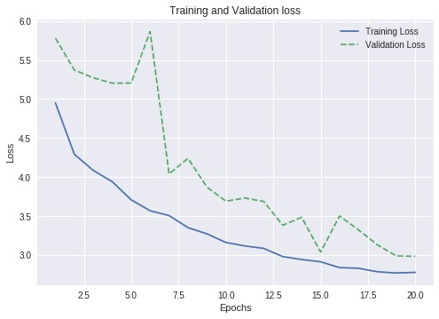

## Contents
{:.no_toc}
*  
{: toc}

## 1. Summary

In this work several custom built and existing model architectures have been tested on the "Stanford Dogs Dataset". With increasing validation accuracy, work has progressed on different networks until a very satisfactory **53.08%** accuracy was found on the validation set using the XCeption Model with Data Augmentation and Cropped Images. 

In order to get to this accuracy several models with modified architectures, data augmentation, reshaping, cropping and modification had to be performed in order to increse the accuracy. A large 51% increase in validation accuracy was seen between the fully connected baseline NN and the final XCeption Model with Data Augmentation and Cropped Images.

## 3. Conclusion

A couple of concluding words to summarize what has already been said in the preceding sections:

*   Our hand-crafted CNN performed remarkably well, achieving 13.25% accuracy on the validation set without any dropout layers.  Adding drop-out layers improved the performance to 18.830% which, at the time the Stanford Dataset was released, would nearly be state of the art. 

*   We notice surprisingly weak performance on fine-tuned versions of the VGG and Inception networks, irrespective of data augmentation or drop-out layers in the final fully connected network.  It is worth speculating on why this may be the case (especially since our CNN's architecture was based on a shallower version of the VGG).  We suspect that, because VGG and Inception networks are extremely deep and heavy, it can actually generate worse performance on the test set if not trained deeply.  There is a particularly good talk that explains this problem [here](http://techtalks.tv/talks/deep-residual-networks-deep-learning-gets-way-deeper/62358/).  In that talk, the authors demonstrate that overly deep layers regularly have worse performance on training and validation sets relative to shallower networks unless given a large amount of training time to 'catch-up.'  See this image for an empirical demonstration. 

* We notice massive gains in accuracy by using the XCeption model, but which fall below our hand-crafted CNN when using data augmentation.  We suspect that, for each model, data augmentation caused the model to perform worse because we did not utilize cropping.  As a result, it is possible for data augmentation to erase key features of the dog in question, particularly when the dog was a peripheral object in the scene.  Notice that we see enormous gains to data augmentation once we crop the dogs, achieving 53% validation accuracy, and 53% test accuracy. 

 | 

* A couple of details to note: 

  1.  We did not evaluate performance on the test set for each model.  While we could have done so, we felt that it was safer to only test the model that performed best on a validation set.  
  
  2. We had a single un-changing validation set.  Whereas standard practice in ML is to use cross-validation, it is typically not done in CNN contexts due to the heavy computational requirements.  Thankfully, this was not an issue, as our model performed equally well on the test and validation sets. 
